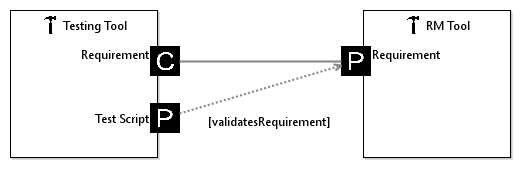
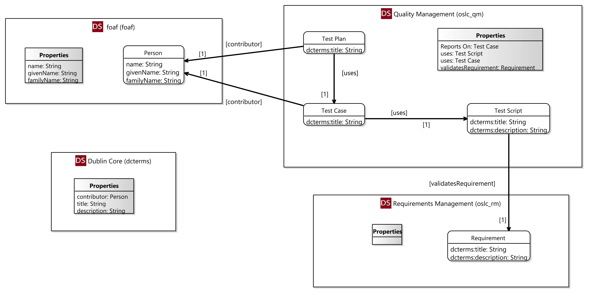

# lyo-adaptor-sample-modelling

This is the repository with the sources of the finished [Lyo Toolchain Modelling and Code Generation Workshop](https://wiki.eclipse.org/Lyo/ToolchainModellingAndCodeGenerationWorkshop).

**Note**: If you want to work with the latest version of the Lyo SDK and Lyo Designer (that is, 4.0.0-SNAPSHOT, which uses JAX-RS2.0, instead of Wink), then please refer to the [4.0.0-snapshot branch](https://github.com/OSLC/lyo-adaptor-sample-modelling/tree/4.0.0-snapshot)

The repository contains 
 * **toolchain-model** - A Lyo Designer modelling project that models 2 communicating OSLC Servers, together with their relevant domain specifications. 
 * **adaptor-rm-webapp** - an OSLC server that serves Requirement resources. See the project [Read Me](https://github.com/OSLC/lyo-adaptor-sample-modelling/tree/master/adaptor-rm-webapp) for instructions on how to run. 
 * **adaptor-testing-webapp** - an OSLC server that serves TestScript resources, while consuming resources from the *adaptor-rm-webapp* server. See the project [Read Me](https://github.com/OSLC/lyo-adaptor-sample-modelling/tree/master/adaptor-testing-webapp) for instructions on how to run.

